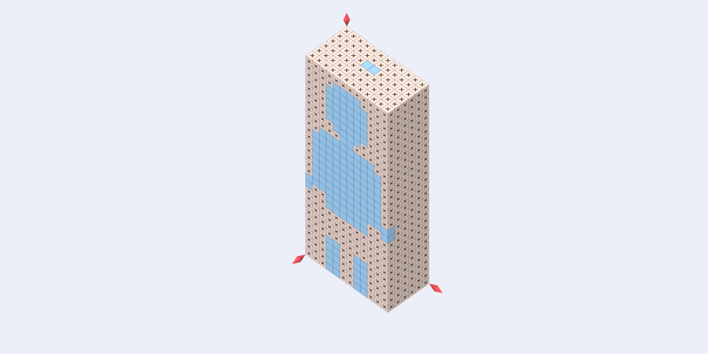

# Voxel Challenge

## Description
A short demonstration of nonograms puzzle in 3D, where you need to reveal a hidden voxel model solving all layers of picture logic puzzles in which cells in a grid must be colored or left blank according to numbers at the side of the grid.

## How to Play
Drag the sliders to show internal layers.

Click on the layer to play nonogram.

Click in the cell to color or clear it. You can also drag across multiple cells.

Click on the symbol in the upper left corner to select a cross to mark cells you are certain are spaces.

Click on empty area to return to the layer selection.

## Run
[Open on GitHub Pages](https://iliagrigorevdev.github.io/voxelchallenge/)

## Built With
[three.js](https://github.com/mrdoob/three.js), JavaScript 3D library.

[vox.js](https://github.com/daishihmr/vox.js), [MagicaVoxel](https://ephtracy.github.io/) model data parser and mesh builder.

Voxel character by [John B. Marine](https://opengameart.org/content/voxel-character-starter-pack)
